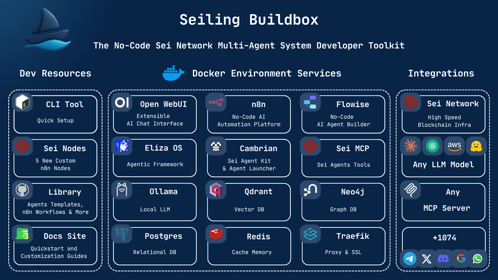

 

> **Complete No-Code AI Agent Development Toolkit for Sei Network**


[](https://opensource.org/licenses/MIT)
[](https://www.docker.com/)
[](https://sei.io/)


**🚀 This project was built for the [Sei Network Hackathon - AI Accelathon](https://dorahacks.io/hackathon/aiaccelathon/buidl) Tooling and Infra Track!**

## 🌟 Overview

**Seiling Buidlbox** is a comprehensive no-code toolkit that democratizes AI agent development on the Sei Network. This developer-focused, containerized solution combines multiple best-in-class frameworks into a unified development environment that enables developers of all skill levels to create sophisticated multi-agent systems without extensive blockchain or AI expertise.

### 🎯 Vision
To become the definitive toolkit for no-code AI agent development on Sei Network, enabling developers to rapidly build, deploy, and manage sophisticated blockchain automation systems.


## 🏗️ Architecture




## 🚀 What You Get

**12 Production-Ready Services** working together out of the box:

### 🖥️ User Interface Services
- **[OpenWebUI](packages/seiling-buidlbox-docs/docs/services/openwebui.md)** - Primary chat interface (Port: 5002)
  - *Image: `ghcr.io/open-webui/open-webui:main`*
- **[n8n](packages/seiling-buidlbox-docs/docs/services/n8n.md)** - Visual workflow builder with custom Sei nodes (Port: 5001)
  - *Image: `n8nio/n8n:latest`*
- **[Flowise](packages/seiling-buidlbox-docs/docs/services/flowise.md)** - Visual AI agent builder (Port: 5003)
  - *Image: `flowiseai/flowise:latest`*

### 🤖 AI Agent Frameworks
- **[ElizaOS](packages/seiling-buidlbox-docs/docs/services/eliza.md)** - Advanced conversational AI framework (Port: 5005)
  - *Image: `0xn1c0/eliza:multi`*
- **[Cambrian](packages/seiling-buidlbox-docs/docs/services/cambrian.md)** - Multi-modal agent platform with DeFi integration (Port: 5006)
  - *Image: `0xn1c0/cambrian-agent-launcher:latest`*
- **[Sei MCP Server](packages/seiling-buidlbox-docs/docs/services/sei-mcp.md)** - Blockchain operations via Model Context Protocol (Port: 5004)
  - *Image: `0xn1c0/sei-mcp-server:multi`*

### 🗄️ Database Services
- **[PostgreSQL](packages/seiling-buidlbox-docs/docs/services/postgres.md)** - Primary relational database (Port: 5432)
  - *Image: `postgres:16-alpine`*
- **[Redis](packages/seiling-buidlbox-docs/docs/services/redis.md)** - Cache and session storage (Port: 6379)
  - *Image: `redis:7-alpine`*
- **[Qdrant](packages/seiling-buidlbox-docs/docs/services/qdrant.md)** - Vector database for AI embeddings (Port: 6333)
  - *Image: `qdrant/qdrant:latest`*
- **[Neo4j](packages/seiling-buidlbox-docs/docs/services/neo4j.md)** - Graph database for relationships (Port: 7474)
  - *Image: `neo4j:5-community`*

### 🚀 Infrastructure Services
- **[Traefik](packages/seiling-buidlbox-docs/docs/services/traefik.md)** - Reverse proxy with SSL termination (Ports: 80/443/8080)
  - *Image: `traefik:v3.0`* - **Disabled by default**
- **[Ollama](packages/seiling-buidlbox-docs/docs/services/ollama.md)** - Local LLM server (Port: 11434)
  - *Image: `ollama/ollama:latest`* - **Disabled by default** (requires 8GB+ RAM)

### Core Infrastructure Services
```
┌─────────────────┐    ┌─────────────────┐    ┌─────────────────┐
│   OpenWebUI     │    │   Flowise       │    │      n8n        │
│ Chat Interface  │    │ Agent Builder   │    │ Workflow Engine │
│   (Port 5002)   │    │   (Port 5003)   │    │   (Port 5001)   │
└─────────────────┘    └─────────────────┘    └─────────────────┘
         │                       │                       │
         └───────────────────────┼───────────────────────┘
                                 │
┌─────────────────┐    ┌─────────────────┐    ┌─────────────────┐
│   ElizaOS       │    │   Cambrian      │    │   Sei MCP       │
│ AI Framework    │    │ Multi-Modal     │    │   Server        │
│   (Port 5005)   │    │   (Port 5006)   │    │   (Port 5004)   │
└─────────────────┘    └─────────────────┘    └─────────────────┘
```

### Data Layer Architecture
- **PostgreSQL**: Primary relational database with ACID compliance
- **Redis**: High-performance in-memory caching and session management
- **Qdrant**: Vector database for semantic search and AI embeddings
- **Neo4j**: Graph database for complex relationship modeling

## 🚀 Quick Start

### Prerequisites
- **4GB+ RAM** minimum (8GB+ recommended)
- **10GB+ Storage** for all services
- **~4GB** Docker image downloads
- **Internet connection** for downloading dependencies

**Note**: The bootstrap script automatically installs Git, Docker, Python3, and other required dependencies.

### Required Credentials
- **OpenAI API key** (`sk-proj-your_openai_api_key_here`) - for AI agents
- **Sei Network private key** (`0xyour_sei_private_key_here`) - for blockchain integration

### One-Command Installation

#### Interactive Setup (Recommended)
```bash
curl -sSL https://raw.githubusercontent.com/nicoware-dev/seiling-buidlbox/main/bootstrap.sh | bash
```

#### Automatic Setup (Production/CI)
```bash
curl -sSL https://raw.githubusercontent.com/nicoware-dev/seiling-buidlbox/main/bootstrap.sh | bash -s -- -auto
```

#### Test Mode (Validation Only)
```bash
curl -sSL https://raw.githubusercontent.com/nicoware-dev/seiling-buidlbox/main/bootstrap.sh | bash -s -- -test
```

#### Combined Auto-Test (Automated Validation)
```bash
curl -sSL https://raw.githubusercontent.com/nicoware-dev/seiling-buidlbox/main/bootstrap.sh | bash -s -- -auto -test
```

#### Fresh VM Setup (with sudo if needed)
```bash
curl -sSL https://raw.githubusercontent.com/nicoware-dev/seiling-buidlbox/main/bootstrap.sh | sudo bash
```

#### Permission Issues on Fresh VMs
If you encounter "Permission denied" errors when running the bootstrap script:

```bash
# Quick fix if already cloned:
cd seiling-buidlbox
chmod +x bootstrap.sh scripts/bootstrap/*.sh
./bootstrap.sh

# Or use sudo for the initial run:
curl -sSL https://raw.githubusercontent.com/nicoware-dev/seiling-buidlbox/main/bootstrap.sh | sudo bash
```

> **Note**: On fresh VMs, you may need `sudo` permissions to install Git and Docker automatically. The bootstrap script now automatically sets execute permissions after cloning.

### Manual Setup
```bash
git clone https://github.com/nicoware-dev/seiling-buidlbox.git
cd seiling-buidlbox

# Interactive setup (recommended)
./bootstrap.sh

# Auto mode (non-interactive)
./bootstrap.sh -auto

# Test mode (validate setup without deployment)
./bootstrap.sh -test

# Auto-test mode (automated validation)
./bootstrap.sh -auto -test
```

### Access Your Platform

After deployment completes, access these services:

| Service | URL | Purpose | Status | Documentation |
|---------|-----|---------|--------|---------------|
| **OpenWebUI** | http://localhost:5002 | Primary chat interface | Always enabled | [Guide](packages/seiling-buidlbox-docs/docs/services/openwebui.md) |
| **n8n** | http://localhost:5001 | Workflow builder | Always enabled | [Guide](packages/seiling-buidlbox-docs/docs/services/n8n.md) |
| **Flowise** | http://localhost:5003 | Agent builder | Always enabled | [Guide](packages/seiling-buidlbox-docs/docs/services/flowise.md) |
| **ElizaOS** | http://localhost:5005 | AI framework | Enabled by default | [Guide](packages/seiling-buidlbox-docs/docs/services/eliza.md) |
| **Cambrian** | http://localhost:5006 | DeFi agents | Enabled by default | [Guide](packages/seiling-buidlbox-docs/docs/services/cambrian.md) |
| **Sei MCP** | http://localhost:5004 | Blockchain tools | Enabled by default | [Guide](packages/seiling-buidlbox-docs/docs/services/sei-mcp.md) |
| **Neo4j** | http://localhost:7474 | Graph database | Enabled by default | [Guide](packages/seiling-buidlbox-docs/docs/services/neo4j.md) |
| **Qdrant** | http://localhost:6333 | Vector database | Enabled by default | [Guide](packages/seiling-buidlbox-docs/docs/services/qdrant.md) |
| **Documentation** | http://localhost:1111 | Complete guides | When running | [Docs Site](packages/seiling-buidlbox-docs/) |

### Default Credentials
- **Flowise**: admin / seiling123
- **PostgreSQL**: postgres / seiling123
- **Redis**: password seiling123
- **Neo4j**: neo4j / seiling123

> **⚠️ Production Warning**: Change all default passwords before deploying to production!

### Post-Installation Commands

#### Health Monitoring
```bash
# Quick health check (all services)
bash scripts/bootstrap/health_check.sh quick

# Comprehensive health check with retries
bash scripts/bootstrap/health_check.sh full

# Check service status
docker compose ps
```

#### Troubleshooting
```bash
# Interactive troubleshooting menu
bash scripts/bootstrap/troubleshoot.sh

# View logs for specific service
docker logs seiling-<service-name>

# Restart specific service
docker restart seiling-<service-name>

# Complete restart of all services
docker compose restart
```

#### Cleanup & Reset
```bash
# Clean up Docker resources
bash scripts/bootstrap/cleanup_docker.sh

# Fix common issues automatically
bash scripts/bootstrap/fix_services.sh

# Reset environment (re-run setup)
rm .env && ./bootstrap.sh
```

### Bootstrap Script Ecosystem

The bootstrap system includes comprehensive automation and utilities. For complete details, see **[📋 Bootstrap Scripts Documentation](scripts/bootstrap/README.md)**.

#### **Core Scripts** (`scripts/bootstrap/`)
- **`bootstrap.sh`** - Main orchestrator with auto/test modes
- **`configure_env.sh`** - Environment configuration with profiles (default, local-dev, remote, full, custom)
- **`deploy_services.sh`** - Docker service management with health monitoring
- **`health_check.sh`** - Dedicated service health monitoring (quick/full modes)
- **`troubleshoot.sh`** - Diagnostic and repair tools with automated fixes

#### **Setup & Dependencies**
- **`detect_os.sh`** - OS detection and validation
- **`install_deps.sh`** - Automated dependency installation (Docker, Git, Python3)
- **`project_setup.sh`** - Git submodules and project structure setup
- **`generate_wallet.sh`** - Sei Network wallet generation (non-interactive mode)

#### **Maintenance & Utilities**
- **`cleanup_docker.sh`** - Docker cleanup and reset utilities
- **`fix_services.sh`** - Service-specific repair operations
- **`docker_status.sh`** - Container status monitoring
- **`windows_docker_helper.sh`** - Windows-specific optimizations

#### **Testing & Validation**
- **`test_suite.sh`** - Automated testing framework
- **`test_ui.sh`** - UI component testing
- **`shared_config.sh`** - Common functions and configuration

#### **User Interface** (`scripts/bootstrap/ui/`)
- **`menu.sh`** - Interactive menu system
- **`progress.sh`** - Progress bars and status indicators  
- **`spinner.sh`** - Loading animations
- **`status.sh`** - Status reporting and formatting

For detailed bootstrap documentation, see **[🔧 Bootstrap Scripts Documentation](scripts/bootstrap/README.md)**.

## 📦 Project Structure

```
seiling-buidlbox/
├── packages/                        # Core platform packages → [📦 Details](packages/README.md)
│   ├── n8n-nodes-sei/             # Custom Sei Network nodes for n8n
│   ├── sei-mcp-server/            # Sei Model Context Protocol server
│   ├── cambrian-agent-launcher/   # Next.js frontend for Cambrian agent
│   ├── eliza-develop/             # ElizaOS framework codebase
│   ├── sei-agent-kit-custom/      # Custom fork of Sei Agent Kit
│   └── seiling-buidlbox-docs/     # Complete documentation site
├── scripts/                         # Bootstrap and automation scripts
│   └── bootstrap/                 # Setup automation (20+ scripts) → [🔧 Details](scripts/bootstrap/README.md)
├── resources/                       # Templates and examples → [📚 Details](resources/README.md)
│   ├── n8n/                      # 10 workflow templates (260KB)
│   ├── flowise/                   # Agent flow templates
│   └── openwebui/                 # 4 service integration functions
├── docker/                          # Docker configurations → [🐳 Details](docker/README.md)
│   └── services/                  # Individual service compose files
│   └── bootstrap/                  # Bootstrap system scripts
├── resources/                      # Example implementations and templates
│   ├── n8n/                       # n8n workflow examples
│   ├── flowise/                    # Flowise agent templates
│   └── openwebui/                 # OpenWebUI function examples
└── docs/                           # Core documentation files
```

## 🤖 Agent Ecosystem

For comprehensive package details, see **[📦 Packages Documentation](packages/README.md)**.

### Core AI Frameworks

#### ElizaOS Framework
- **Package**: `eliza-develop/` - Complete ElizaOS codebase
- **Image**: `0xn1c0/eliza:multi`
- **Features**: Conversational AI, Sei blockchain integration, multi-modal interactions
- **Access**: http://localhost:5005

#### Cambrian Framework
- **Package**: `cambrian-agent-launcher/` - Next.js frontend interface
- **Image**: `0xn1c0/cambrian-agent-launcher:latest`
- **Features**: Multi-modal AI, DeFi operations, agent orchestration
- **Access**: http://localhost:5006

### Blockchain Integration

#### Sei MCP Server
- **Package**: `sei-mcp-server/` - Complete MCP implementation
- **Image**: `0xn1c0/sei-mcp-server:multi`
- **Features**: 27 blockchain tools, multi-network support
- **Access**: http://localhost:5004

#### Custom n8n Nodes
- **Package**: `n8n-nodes-sei/` - 5 specialized Sei blockchain nodes
- **Features**: Smart contracts, transactions, queries
- **Documentation**: [Sei n8n Nodes Guide](packages/seiling-buidlbox-docs/docs/resources/sei-n8n-nodes.md)

## 🎯 Use Cases & Templates

For complete templates and examples, see **[📚 Resources Documentation](resources/README.md)**.

### Pre-Built Templates
- **[n8n Workflow Templates](resources/README.md#n8n-workflow-templates)** - 10 production-ready automation workflows
- **[Flowise Agent Templates](resources/README.md#flowise-agent-templates)** - Visual AI agent flows with MCP integration
- **[OpenWebUI Functions](resources/README.md#openwebui-functions)** - 4 service integration functions

### Common Use Cases
- **DeFi Automation**: Automated trading, yield farming, portfolio management
- **Conversational Agents**: Blockchain-aware chatbots and assistants
- **Workflow Automation**: Complex multi-step blockchain operations
- **Portfolio Analysis**: Real-time monitoring and optimization
- **Research Automation**: Market analysis and reporting

## 🔧 Configuration

### Default Profile (Recommended)
All services enabled except Traefik and Ollama:
```bash
ENABLE_OPENWEBUI=yes        # Always enabled
ENABLE_N8N=yes              # Always enabled  
ENABLE_FLOWISE=yes          # Always enabled
ENABLE_ELIZA=yes            # Enabled by default
ENABLE_CAMBRIAN=yes         # Enabled by default
ENABLE_SEI_MCP=yes          # Enabled by default
ENABLE_POSTGRES=yes         # Always enabled
ENABLE_REDIS=yes            # Always enabled
ENABLE_QDRANT=yes           # Enabled by default
ENABLE_NEO4J=yes            # Enabled by default
ENABLE_TRAEFIK=no           # Disabled for local development
ENABLE_OLLAMA=no            # Disabled due to high resource usage
```

### Service Categories

#### 🚀 **Always Enabled** (Core Infrastructure)
These services form the foundation and cannot be disabled:
- OpenWebUI, n8n, Flowise, PostgreSQL, Redis

#### ⚡ **Enabled by Default** (AI & Blockchain)
These provide the main AI and blockchain functionality:
- ElizaOS, Cambrian, Sei MCP Server, Qdrant, Neo4j

#### 🔧 **Optional Services** (Production & Advanced)
Enable these based on your specific needs:
- **Traefik**: For production deployments with SSL (requires domain)
- **Ollama**: For local LLM hosting (requires 8GB+ RAM)

### Resource Requirements
- **Default Setup**: 10 containers, ~4GB RAM, 10GB storage
- **With Ollama**: 11 containers, ~8GB RAM, 15GB storage  
- **With Traefik**: 12 containers (production setup)

### Production Setup
- Enable Traefik for SSL termination
- Configure custom domain
- Update security credentials
- See [Configuration Guide](packages/seiling-buidlbox-docs/docs/getting-started/configuration.md)

### Service Control
```bash
# Edit .env file to enable/disable services
ENABLE_OPENWEBUI=yes
ENABLE_N8N=yes
ENABLE_FLOWISE=yes
ENABLE_ELIZA=yes
ENABLE_CAMBRIAN=yes
ENABLE_SEI_MCP=yes
ENABLE_POSTGRES=yes
ENABLE_REDIS=yes
ENABLE_QDRANT=yes
ENABLE_NEO4J=yes
ENABLE_TRAEFIK=no      # Production only
ENABLE_OLLAMA=no       # Requires 8GB+ RAM

# Restart services
docker compose restart
```

## 📚 Documentation

### Complete Documentation Hub
Access the full documentation at http://localhost:1111 when running, or browse by category:

#### 📋 **Core Documentation**
- **[📦 Packages Documentation](packages/README.md)** - Complete package overview and development guides
- **[📚 Resources Documentation](resources/README.md)** - Templates, examples, and usage patterns
- **[🐳 Docker Documentation](docker/README.md)** - Container deployment and management
- **[🔧 Bootstrap Documentation](scripts/bootstrap/README.md)** - Setup automation and troubleshooting

#### 🚀 **Getting Started**
- **[Quick Start Guide](packages/seiling-buidlbox-docs/docs/getting-started/quick-start.md)** - Get running in 5 minutes
- **[Configuration Guide](packages/seiling-buidlbox-docs/docs/getting-started/configuration.md)** - Complete setup instructions
- **[User Guide](packages/seiling-buidlbox-docs/docs/getting-started/user-guide.md)** - How to use each service
- **[Default Settings Reference](DEFAULT_SETTINGS.md)** - All configuration values

#### 🔧 **Technical References**
- **[Services Overview](packages/seiling-buidlbox-docs/docs/services/overview.md)** - Complete service documentation
- **[Bootstrap Setup Guide](BOOTSTRAP_SETUP.md)** - Universal deployment instructions  
- **[External Resources](packages/seiling-buidlbox-docs/docs/resources/external-resources.md)** - Links to official documentation

#### 📖 **Documentation Site**
- **[Documentation Source](packages/seiling-buidlbox-docs/)** - Docusaurus documentation site
- **[Live Documentation](http://localhost:1111)** - When running locally

## 🛠️ Development

For detailed development information:
- **[📦 Package Development](packages/README.md)** - Individual package setup and development
- **[🐳 Docker Development](docker/README.md)** - Container development and debugging
- **[🔧 Bootstrap Development](scripts/bootstrap/README.md)** - Script development and testing

### Local Development Setup
```bash
# Clone and setup
git clone https://github.com/nicoware-dev/seiling-buidlbox.git
cd seiling-buidlbox

# Install dependencies for specific packages (see packages/README.md for details)
cd packages/n8n-nodes-sei && npm install       # Custom n8n nodes
cd packages/sei-mcp-server && npm install      # MCP server
cd packages/cambrian-agent-launcher && npm install  # Cambrian frontend
cd packages/seiling-buidlbox-docs && npm install   # Documentation

# Start development environment
./bootstrap.sh
```

### Health Monitoring
```bash
# Quick health check
bash scripts/bootstrap/health_check.sh quick

# Full health check with retries
bash scripts/bootstrap/health_check.sh full

# Check specific service
docker logs seiling-<service-name>
```

### Troubleshooting
```bash
# Interactive troubleshooting menu
bash scripts/bootstrap/troubleshoot.sh

# Reset everything (WARNING: loses data)
docker compose down -v
./bootstrap.sh
```

## 🎓 Learning Paths

### 👶 Beginner Path
1. **[Quick Start](packages/seiling-buidlbox-docs/docs/getting-started/quick-start.md)** - Deploy and explore
2. **[User Guide](packages/seiling-buidlbox-docs/docs/getting-started/user-guide.md)** - Learn each interface
3. **[n8n Templates](packages/seiling-buidlbox-docs/docs/resources/n8n-templates.md)** - Try pre-built workflows
4. **[Build Your First Agent](packages/seiling-buidlbox-docs/docs/services/flowise.md)** - Create AI agents

### 👨‍💻 Developer Path
1. **[Configuration](packages/seiling-buidlbox-docs/docs/getting-started/configuration.md)** - Custom setup
2. **[Services Overview](packages/seiling-buidlbox-docs/docs/services/overview.md)** - Technical architecture
3. **[Custom n8n Nodes](packages/seiling-buidlbox-docs/docs/resources/sei-n8n-nodes.md)** - Blockchain integration
4. **[Production Deployment](packages/seiling-buidlbox-docs/docs/getting-started/deployment.md)** - Scale to production

### 🏗️ Advanced Path
1. **[Agent Development](packages/seiling-buidlbox-docs/docs/services/eliza.md)** - Custom AI frameworks
2. **[DeFi Integration](packages/seiling-buidlbox-docs/docs/services/cambrian.md)** - Advanced blockchain operations
3. **[Multi-Agent Systems](packages/seiling-buidlbox-docs/docs/resources/n8n-templates.md)** - Complex orchestration

## 🔐 Security & Production

### Development (Default)
- Localhost access only
- Default passwords for databases (seiling123)
- No SSL certificates required
- Traefik disabled

### Production Deployment
**MUST CHANGE for production:**
```bash
# Generate strong passwords
POSTGRES_PASSWORD=your_strong_password
N8N_ENCRYPTION_KEY=your_32_char_encryption_key
WEBUI_SECRET_KEY=your_strong_secret_key
FLOWISE_PASSWORD=your_strong_password

# Enable production features
ENABLE_TRAEFIK=yes
BASE_DOMAIN_NAME=your-domain.com
TRAEFIK_EMAIL=admin@your-domain.com
```

See [Production Guide](packages/seiling-buidlbox-docs/docs/getting-started/deployment.md) for complete setup.

## 📈 Performance & Specifications

### System Requirements
- **Minimum**: 4GB RAM, 10GB storage
- **Recommended**: 8GB+ RAM, 20GB+ storage
- **With Ollama**: 16GB+ RAM for local LLM

### Performance Metrics
- **Deployment Time**: < 10 minutes complete setup
- **Docker Images**: ~4GB total download
- **Container Count**: 10 services (12 with optional services)
- **Service Startup**: < 5 minutes for all services
- **Transaction Processing**: Sub-400ms leveraging Sei Network performance

### Network Configuration
- **Default Domain**: localhost
- **RPC URL**: https://evm-rpc.sei-apis.com
- **Database Type**: SQLite for n8n (reliability), PostgreSQL for application data

## 📖 Complete Documentation Index

### 📂 **Folder-Specific Documentation**
| Folder | README | Description | Key Topics |
|--------|--------|-------------|------------|
| **[packages/](packages/)** | **[📦 README](packages/README.md)** | Core platform packages | Package overview, development setup, technology stacks |
| **[resources/](resources/)** | **[📚 README](resources/README.md)** | Templates & examples | n8n workflows, Flowise agents, OpenWebUI functions |  
| **[docker/](docker/)** | **[🐳 README](docker/README.md)** | Container configurations | Service setup, Docker management, troubleshooting |
| **[scripts/bootstrap/](scripts/bootstrap/)** | **[🔧 README](scripts/bootstrap/README.md)** | Setup automation | Script documentation, troubleshooting, profiles |

### 🎯 **Quick Navigation**
- **🚀 Want to start immediately?** → **[Bootstrap Scripts](scripts/bootstrap/README.md#quick-start)**
- **📦 Need package details?** → **[Packages Overview](packages/README.md#package-overview)**
- **📚 Looking for templates?** → **[Resources Guide](resources/README.md#resource-overview)**
- **🐳 Docker issues?** → **[Docker Troubleshooting](docker/README.md#troubleshooting)**
- **📖 Complete guides?** → **[Documentation Site](packages/seiling-buidlbox-docs/)**

### 🔗 **External References**
- **[Default Settings](DEFAULT_SETTINGS.md)** - Complete configuration reference
- **[Bootstrap Setup](BOOTSTRAP_SETUP.md)** - Universal deployment guide
- **[Documentation Site](packages/seiling-buidlbox-docs/)** - Comprehensive guides

## 🤝 Community & Support

### Getting Help
- **Documentation**: [Complete Documentation Site](packages/seiling-buidlbox-docs/)
- **GitHub Issues**: [Report bugs and request features](https://github.com/nicoware-dev/seiling-buidlbox/issues)
- **GitHub Discussions**: [Ask questions and share ideas](https://github.com/nicoware-dev/seiling-buidlbox/discussions)

### Contributing
- **Code Contributions**: Submit pull requests for bug fixes and features
- **Documentation**: Help improve guides and tutorials
- **Templates**: Share reusable agent and workflow templates
- **Community**: Help other developers in discussions

## 📄 License

This project is licensed under the MIT License - see the [LICENSE](LICENSE) file for details.

## 🙏 Acknowledgments

- **Sei Network** for the high-performance blockchain infrastructure
- **n8n** for the powerful workflow automation platform
- **ElizaOS** for the conversational AI framework
- **Cambrian** for the multi-modal agent development tools
- **OpenWebUI** for the customizable user interface
- **Flowise** for the visual AI agent builder
- **Community Contributors** for their valuable feedback and contributions

---

**Built with ❤️ for the Sei Network ecosystem**

*Seiling Buidlbox - Empowering developers to build the future of blockchain automation* 